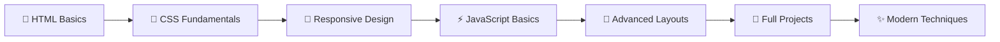

<div align="center">

# 🚀 SigmaWeb-DEVelopment

<p align="center">
  
</p>

<p align="center">
  
  
  
</p>

<p align="center">
  
  
  
  
</p>

<p align="center">
  <a href="#-about-the-project">About</a> •
  <a href="#-project-structure">Structure</a> •
  <a href="#-technologies">Tech Stack</a> •
  <a href="#-quick-start">Quick Start</a> •
  <a href="#-learning-path">Learning Path</a> •
  <a href="#-roadmap">Roadmap</a> •
  <a href="#-contributing">Contributing</a>
</p>


</div>

## 🎯 About The Project

**SigmaWeb-DEVelopment** is a comprehensive, hands-on web development learning repository that chronicles a complete journey from HTML/CSS fundamentals to building production-ready business websites. This project showcases practical implementation of modern web development concepts, responsive design principles, and real-world project development.

### ✨ What Makes This Special

<table>
<tr>
<td width="33%" valign="top">

### 🎨 **Progressive Learning**
- **Structured Curriculum**: Follows the Sigma Web Development course
- **Hands-on Practice**: Every concept backed by practical exercises
- **Real Projects**: From basic layouts to complete business sites

</td>
<td width="33%" valign="top">

### 🚀 **Modern Techniques**
- **Responsive Design**: Mobile-first approach
- **Clean Code**: Semantic HTML & organized CSS
- **Performance**: Optimized assets and loading

</td>
<td width="33%" valign="top">

### 💡 **Industry Ready**
- **Best Practices**: Following current web standards
- **Accessibility**: WCAG compliant markup
- **Cross-browser**: Consistent experience across platforms

</td>
</tr>
</table>

---

## 📁 Project Structure

<details>
<summary>🗂️ <strong>Click to explore the complete repository structure</strong></summary>

```
SigmaWeb-DEVelopment/
├── 🎨 CSS/                    # Core CSS learning modules
│   ├── 📚 video21-38/         # Video tutorials implementation
│   │   ├── 🎯 video30/        # CSS Variables & Custom Properties
│   │   ├── 📱 video31/        # Media Queries & Responsive Design
│   │   ├── 🎪 video35/        # Float & Clear positioning
│   │   ├── 🧩 video36/        # Advanced CSS Selectors
│   │   └── 💪 video38/        # Flexbox Layout System
│   └── 🏋️ Exercises/         # Practical challenges
│       ├── 🎪 Exercise2/      # Layout fundamentals
│       ├── 🎨 Exercise3/      # Styling challenges  
│       └── ⚡ Exercise5/      # Advanced CSS techniques
│
├── 🌟 Jauntic/               # Complete business website
│   ├── 🏠 jauntsol.html      # Main landing page
│   ├── 🎨 style.css          # Bootstrap 5 + Custom styles
│   ├── ⚡ script.js           # Theme switcher & interactions
│   ├── 🖼️ assets/            # Images & media files
│   └── 🧱 commons/           # Reusable components
│
├── ✨ modern/                # Redesigned Jaunt Solutions
│   ├── 🏠 modern-index.html  # Clean, minimal design
│   ├── 🎨 modern-style.css   # CSS Variables & utilities
│   ├── ⚡ modern-script.js    # Enhanced interactions
│   └── 📁 assets/           # Optimized assets
│
└── 📚 old/                   # Foundation learning files
    ├── 🎯 video2-12.html     # HTML fundamentals
    ├── 📱 Quiz1.html          # Knowledge assessment
    ├── 📞 phonetable.html     # Table layout practice
    └── 🎥 youtube.html        # Complex layout clone
```

</details>

---

## 🛠️ Technologies & Tools

<div align="center">

### Frontend Technologies
<p>
  
  
  
  
</p>

### Development Tools
<p>
  
  
  
</p>

### Design & Layout
<p>
  
  
  
</p>

</div>

---

## ⚡ Quick Start

<table>
<tr>
<td>

### 🔧 **Setup Instructions**

```bash
# 1. Clone the repository
git clone https://github.com/Omnicode786/SigmaWeb-DEVelopment.git

# 2. Navigate to project directory
cd SigmaWeb-DEVelopment

# 3. Open with your preferred code editor
code .
```

</td>
<td>

### 🚀 **Launch Options**

```bash
# View a specific tutorial
# Example: Flexbox demo
open CSS/video38/flexbox/flexbox.html

# Launch the main business site
open Jauntic/jauntsol.html

# Check out the modern redesign
open modern/modern-index.html
```

</td>
</tr>
</table>

<div align="center">
  
  
  
</div>

---

## 🎓 Learning Path

<div align="center">

### 📈 **Progressive Skill Development**



</div>

<details>
<summary>🔍 <strong>Detailed Learning Modules</strong></summary>

| Phase | Module | Topics Covered | Status |
|-------|---------|----------------|--------|
| **Foundation** | HTML Basics | Structure, Semantics, Forms, Tables | ✅ Complete |
| **Styling** | CSS Fundamentals | Selectors, Box Model, Typography | ✅ Complete |
| **Layout** | CSS Positioning | Float, Flexbox, Grid, Responsive | ✅ Complete |
| **Interactivity** | JavaScript Basics | DOM Manipulation, Events, Themes | ✅ Complete |
| **Projects** | Business Websites | Jaunt Solutions, Theme Switcher | ✅ Complete |
| **Advanced** | Modern Techniques | CSS Variables, Utilities, Performance | 🚧 In Progress |

</details>

---

## 🌟 Featured Projects

<table>
<tr>
<td width="50%" valign="top">

### 🏢 **Jaunt Solutions**
*Complete Business Website*

**Features:**
- 📱 Fully responsive Bootstrap 5 design
- 🌙 Dark/Light theme switcher
- ⚡ Interactive JavaScript components
- 🎨 Professional UI/UX design
- 📄 Multi-section layout

**Tech Stack:** HTML5, CSS3, Bootstrap 5, Vanilla JS

</td>
<td width="50%" valign="top">

### ✨ **Modern Redesign**
*Minimalist Website Recreation*

**Features:**
- 🎨 CSS Variables & custom properties
- 🔧 Utility-first styling approach
- 🚀 Performance optimized
- 📱 Mobile-first responsive design
- 🎯 Clean semantic HTML

**Tech Stack:** HTML5, Modern CSS3, Vanilla JS

</td>
</tr>
</table>

<div align="center">
  
  
  
</div>

---

## 🗺️ Roadmap

<details>
<summary>🚀 <strong>Future Development Plans</strong></summary>

### 📅 **Q1 2025**
- [ ] 🔄 Convert legacy float layouts to CSS Grid implementations
- [ ] 🎬 Add AOS (Animate On Scroll) library integration
- [ ] 🎨 Implement additional color themes and customization options

### 📅 **Q2 2025**
- [ ] ⚡ Performance optimization and lazy loading
- [ ] 🧪 Unit testing implementation with Jest
- [ ] 🔍 SEO optimization and meta tag improvements

### 📅 **Q3 2025**
- [ ] 🌐 Deploy live preview on GitHub Pages
- [ ] 📱 Progressive Web App (PWA) features
- [ ] 🔒 Security best practices implementation

### 📅 **Q4 2025**
- [ ] 🤖 Automated testing and CI/CD pipeline
- [ ] 📊 Analytics and performance monitoring
- [ ] 🌍 Internationalization support

</details>

---

## 🤝 Contributing

<div align="center">
  
</div>

### 🔄 **Contribution Workflow**

<table>
<tr>
<td width="25%" align="center">

### 1️⃣ **Fork**


Fork the repository to your account

</td>
<td width="25%" align="center">

### 2️⃣ **Branch**


Create a feature branch
`git checkout -b feature/amazing-feature`

</td>
<td width="25%" align="center">

### 3️⃣ **Commit**


Commit your changes
`git commit -m 'Add amazing feature'`

</td>
<td width="25%" align="center">

### 4️⃣ **Pull Request**


Open a Pull Request with detailed description

</td>
</tr>
</table>

### 🎯 **Contribution Guidelines**

- ✅ Follow the existing code style and structure
- ✅ Test your changes across different browsers
- ✅ Keep demos self-contained and well-documented
- ✅ Add comments for complex implementations
- ✅ Update README if adding new features

---

## 📊 Repository Statistics

<div align="center">
  
  
</div>

<div align="center">
  
</div>

---

## 📄 License

<div align="center">

This project is licensed under the **MIT License** - see the [LICENSE](LICENSE) file for details.


</div>

---

## 🌟 Acknowledgments

<div align="center">

### 🙏 **Special Thanks**

<table>
<tr>
<td align="center" width="33%">

### 🎓 **CodeWithHarry**
*Sigma Web Development Course*

The foundation and inspiration for this learning journey

</td>
<td align="center" width="33%">

### 🎨 **Bootstrap Team**
*UI Framework*

Rapid prototyping and responsive design components

</td>
<td align="center" width="33%">

### 🔧 **Open Source Community**
*Tools & Resources*

Icons, fonts, and development tools that made this possible

</td>
</tr>
</table>


</div>

---

<div align="center">

### 🚀 **Ready to Start Your Web Development Journey?**

<p>
  <a href="#-quick-start">
    
  </a>
  <a href="https://github.com/Omnicode786/SigmaWeb-DEVelopment/issues">
    
  </a>
  <a href="https://github.com/Omnicode786/SigmaWeb-DEVelopment/discussions">
    
  </a>
</p>

**⭐ Star this repository if you found it helpful! ⭐**


*Happy Coding & Keep Building Amazing Things!* 🚀

</div>